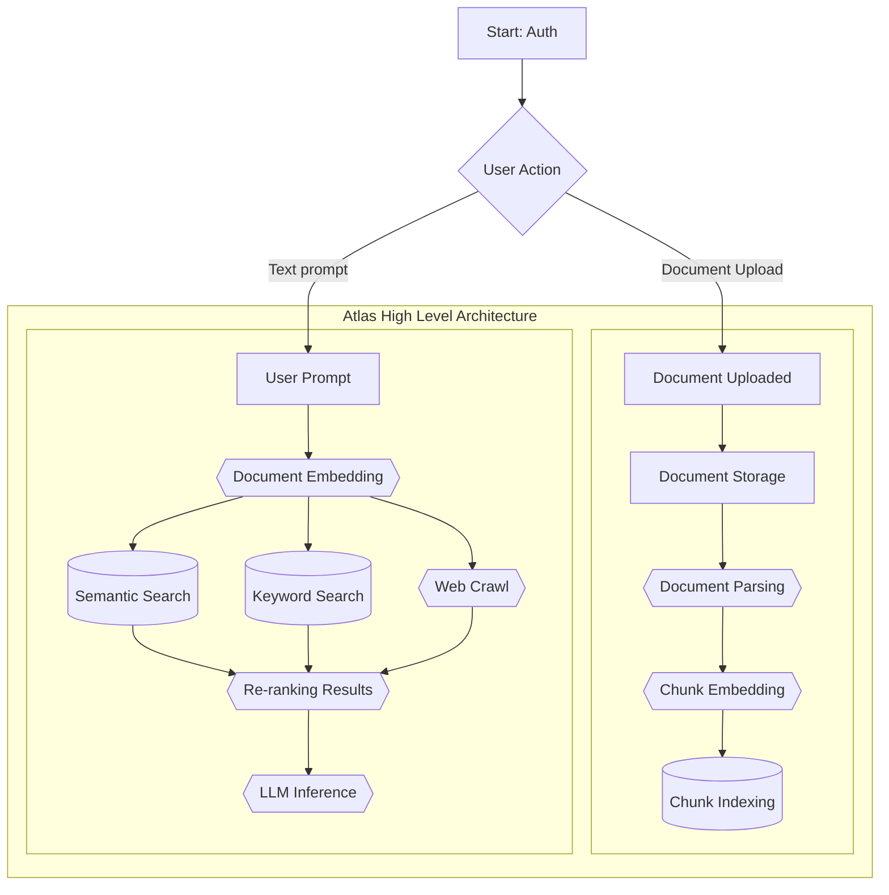

# Atlas


## Architecture



# What's Atlas?

This project is a web-based application built using Next.js and various API integrations including Cohere, OpenAI, Pinecone, and more. Below are the steps to set up the project, configure environment variables, and run it locally.

## Requirements

Before you begin, ensure you have the following installed:
- Node.js (14.x or higher)
- npm or yarn (package managers)
- Git
- MongoDB (local or cloud instance)
- Vercel CLI (optional, but recommended for environment variable management)

## Installation

1. Clone the repository from your fork:
   ```bash
   git clone https://github.com/athrael-soju/atlas-v0.1.git
   cd atlas-v0.1
   ```

2. Install dependencies:
   ```bash
   npm install
   # or
   yarn install
   ```

3. Set up the environment variables (see below for required variables).
4. Make requests to the API endpoints in order to create the assistants and update the database. You can use postman or curl to make these requests. The following are the endpoints to use:
   1. Summon:
      
      
   3. Dismiss:
      
      

   

## Environment Variables

The project requires several environment variables to be set in a `.env` file. Below is a description of the variables you need to configure:

### Authentication & OAuth
- **`AUTH_SECRET`**: A secret key for authentication.
- **`NEXTAUTH_SECRET`**: A secret used for NextAuth.js.

### API Keys
- **`CARTESIA_API_KEY`**: The API key for Cartesia services.
- **`COHERE_API_KEY`**: The API key for Cohere language models.
- **`GROQ_API_KEY`**: The API key for Groq services.
- **`OPENAI_API_KEY`**: The API key for OpenAI GPT models.
- **`PINECONE_API`**: The API key for Pinecone vector database.
- **`UNSTRUCTURED_API`**: The API key for Unstructured parsing services.

### Cohere Configuration
- **`COHERE_API_MODEL`**: The Cohere model to be used (e.g., `rerank-multilingual-v3.0`).
- **`COHERE_RELEVANCE_THRESHOLD`**: Threshold value for Cohere's relevance.

### Pinecone Configuration
- **`PINECONE_INDEX`**: The Pinecone index to be used.
- **`NEXT_PUBLIC_PINECONE_TOPK`**: The top K results returned by Pinecone queries.

### MongoDB Configuration
- **`MONGODB_URI`**: The connection string for MongoDB, either local or remote.

### NextAuth Configuration
- **`NEXTAUTH_URL`**: The base URL for the application (e.g., `http://localhost:3000` or your deployed URL).

### OpenAI Configuration
- **`OPENAI_API_MODEL`**: The OpenAI model (e.g., `gpt-3.5-turbo`).
- **`OPENAI_API_EMBEDDING_MODEL`**: The embedding model to be used for OpenAI (e.g., `text-embedding-3-large`).

### Miscellaneous Configuration
- **`NODE_ENV`**: Should be set to `production` for production environments or `development` for local development.
- **`FILESYSTEM_PROVIDER`**: The filesystem provider used by the application (e.g., `local`).

## Running the Project

1. Ensure your `.env` file is properly configured with all required variables.
2. Run the development server:
   ```bash
   npm run dev
   # or
   yarn dev
   ```

   The app will be running at [http://localhost:3000](http://localhost:3000).

## Deploying to Vercel

You can easily deploy this project to Vercel. After setting up your Vercel account:

1. Push your code to your GitHub repository.
2. Link the repository to Vercel.
3. Ensure the necessary environment variables are set in the Vercel dashboard under **Settings > Environment Variables**.
4. Deploy your project.

For more details, visit the [Vercel documentation](https://vercel.com/docs).

